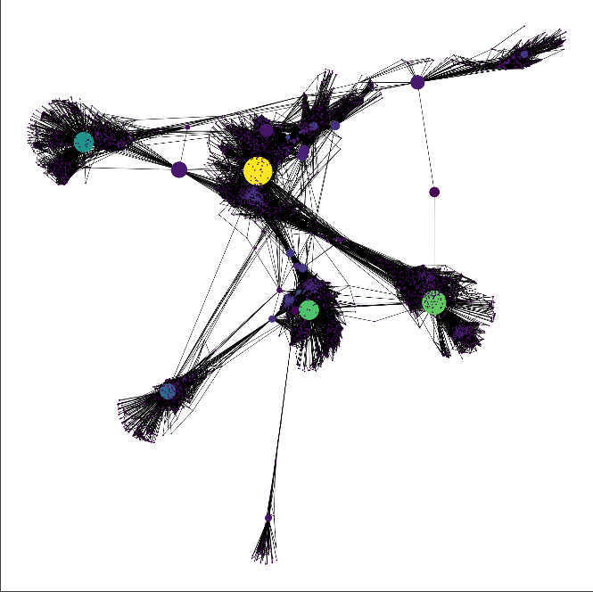
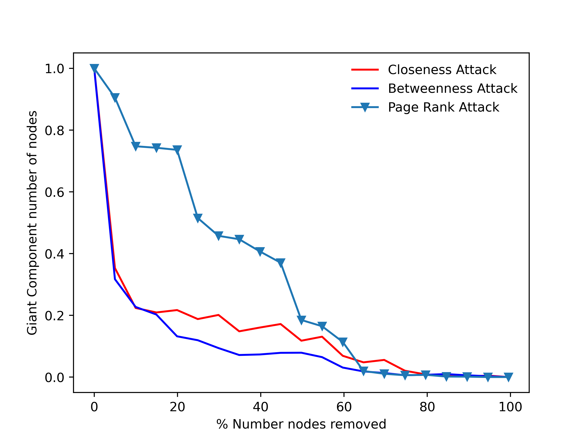
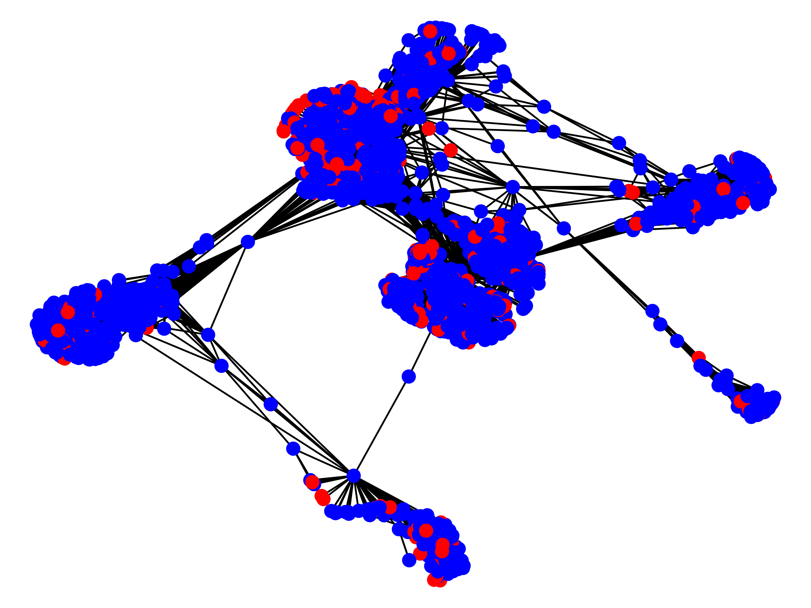

# NetworkXAnalysis
SocialNetwork - DataSet from Stanford Large Network Dataset Collection 
============================================================================

Python Code v3.7

Introduction
------------
This codelab covered: Social network analysis with NetworkX (https://networkx.github.io/)

1. import project in PyCharm
1. import required libraries: networkx as nx; matplotlib.pyplot as plt; collections; numpy.
1. run Facebook.py
1. the program will print every metrics, the Histogram about the degree distribution and the Network.
1. Report about this project is inside the PDF file. (1st_assign-NetworkAnalysis.pdf)

Note: some functions may require time > 2minutes.
Dataset 
------------
from Stanford Large Network Dataset Collection (http://snap.stanford.edu/data/index.html)
* Nodes	= 4039
* Edges	= 88234
* Diameter (longest shortest path) = 8

Results
------------

Robustness
------------
The second part of this codelab covered the robustness of our real Social network.

1. run Facebook2_attack.py if you want to see how a random attack and a high degree attack may intact the net.
1. run Facebook_Robustness_Diameter.py if you want to see how an attack may intact the diameter of the net.
1. run Facebook_Robustness_Giant_Component.py if you want to see how an attack may intact the giant components of the net.
1. the program will plot the results for each attacks performed.
1. Report about this project is inside the PDF file. (2nd_assign-NetworkAnalysis.pdf)

Note: some attack may require time > 5 minutes.

Robustness Analysis Results
------------

Social Contagion
------------
The third part of this codelab covered the social contagion of our real Social network.

1. run Facebook_3_SocialContagion.py
1. the program will print an image per social contagion days inside the folder named social_contagion.
1. Report about this project is inside the PDF file. (3rd_assign-NetworkAnalysis.pdf)

Social Contagion Results
------------

