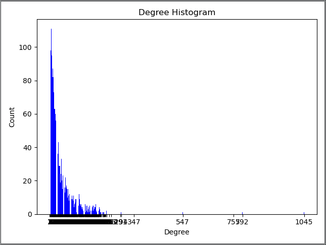
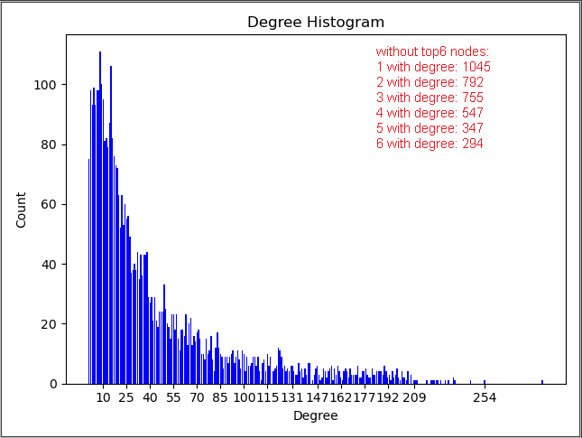

# NetworkXAnalysis
SocialNetwork - DataSet from Stanford Large Network Dataset Collection 
============================================================================

Python Code v3.7

Introduction
------------
This codelab covered: Social network analysis with NetworkX (https://networkx.github.io/)

1. import project in PyCharm
1. import required libraries: networkx as nx; matplotlib.pyplot as plt; collections; numpy.
1. run Facebook.py
1. the program will print every metrics, the Histogram about the degree distribution and the Network.
1. Report aboout this project is inside the PDF file.

Note: some functions may require time > 2minutes.

Results
------------

